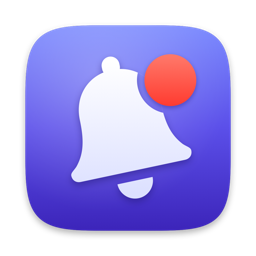
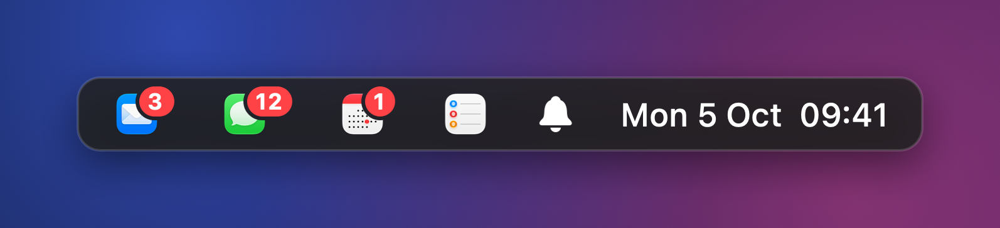
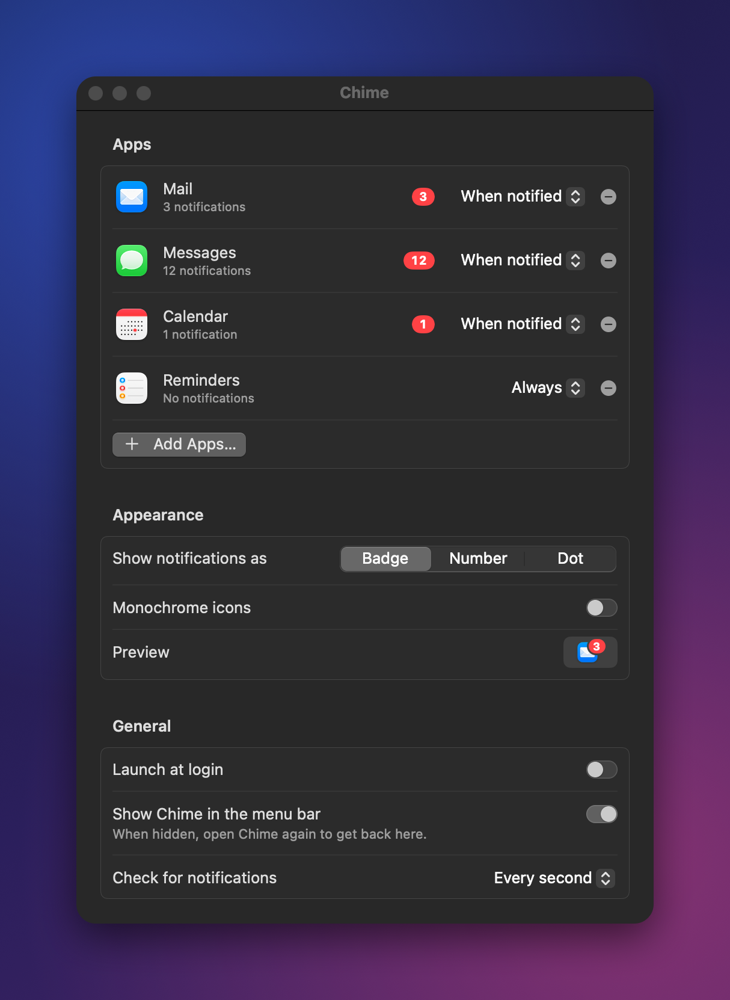
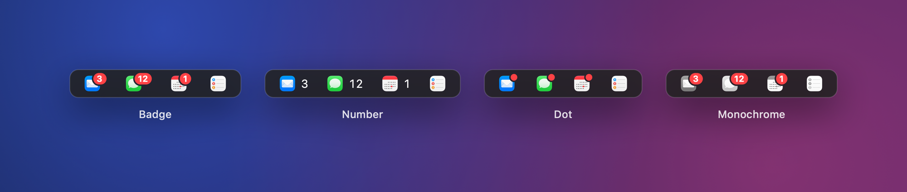

<p align="center">
  
</p>

<h1 align="center">Chime</h1>

<p align="center">
  Shows your apps in the macOS menu bar when they have notifications.
</p>



Pick the apps once. Each one appears in the menu bar with its badge count
whenever it has something for you, and disappears when it does not.

It is useful when the Dock is hidden, or when you just want Slack, Mail and
friends where you can always see them. Inspired by
[Doll](https://github.com/xiaogdgenuine/Doll). Native Swift shell, Rust core.

## Install

```sh
brew install --cask baboons/tap/chime
```

Use the full `baboons/tap/chime` name: Homebrew's own `chime` cask is a
different app. You need macOS 14 or later on Apple Silicon.

<details>
<summary>Without Homebrew</summary>

Download `Chime-aarch64-apple-darwin.zip` from the
[latest release](https://github.com/baboons/chime/releases/latest), unzip it
and move Chime.app to /Applications. Chime is signed but not notarized, so
clear the download quarantine once before opening it:

```sh
xattr -dr com.apple.quarantine /Applications/Chime.app
```
</details>

## Using it

Open Chime. On first launch it shows its window:

1. Click **Open Accessibility Settings…** and turn on Chime in the list.
2. Click **Add Apps…** and pick your apps. Apps with notifications right now
   are listed first. You can also drag apps from Finder onto the window.

After that:

- Click an app in the menu bar to open it. Right-click it for options.
- Each app shows **when notified** (the default) or **always**.
- The bell menu lists every tracked app and leads back to settings. If you hide
  the bell, open Chime again to get the window back.
- ⌘-drag menu bar items to reorder them; Chime remembers where you put them.

<p align="center">
  
</p>

Badges can be drawn as a red badge with the count, a plain number, or a dot,
and icons can be monochrome:



### What Chime can and cannot see

Chime mirrors the badge on each app's Dock icon, so:

- The app has to be in the Dock, which means running or pinned. A hidden Dock is fine.
- The app has to be allowed to badge its icon: System Settings → Notifications →
  the app → **Badge application icon**. A Focus that hides badges hides them from Chime too.
- Reading another app's Dock icon needs Accessibility access. Chime reads the
  Dock and nothing else, and makes no network connections.

## Building

Requirements: macOS 14 or later, a Swift 6 toolchain (the Xcode Command Line
Tools are enough; Xcode itself is not needed) and Rust.

```sh
make app          # build/Chime.app
make run          # build and open it
make install      # build, copy to /Applications and open it
make test         # the core's tests
make zip          # the release archive
make icon         # redraw Resources/AppIcon.icns from scripts/make-icon.swift
make screenshots  # redraw the images in docs/
```

### Keeping Accessibility access across rebuilds

macOS ties the Accessibility grant to the app's code signature. The default
ad hoc signature changes with every build, so after rebuilding you have to
grant access again (if the old entry lingers, clear it with
`tccutil reset Accessibility com.baboons.chime`).

Signing with a certificate avoids that. Any code signing certificate in your
keychain works, including a self-signed one:

```sh
security find-identity -v -p codesigning
make install SIGN_IDENTITY="Name Of Certificate"
```

### Releasing

```sh
scripts/release.sh 0.2.0
```

This bumps the version, commits, tags `v0.2.0` and pushes. The Release workflow
then builds, signs and publishes `Chime-aarch64-apple-darwin.zip`, and the
Homebrew cask in [baboons/homebrew-tap](https://github.com/baboons/homebrew-tap)
is bumped automatically.

Releases are signed with a dedicated self-signed "Chime Release" certificate,
stored in the `CHIME_SIGNING_P12` and `CHIME_SIGNING_PASSWORD` repository
secrets. It must never change: macOS ties the Accessibility permission to it,
so a release signed with anything else makes every user grant access again.

## How it works

Chime is a Rust core with a Swift shell.

```
core/                  Rust: everything that is not UI
  src/ax.rs            safe wrappers over the Accessibility C API
  src/dock.rs          reads the Dock's app icons and their badges
  src/badge.rs         badge text → count and a menu-bar-sized label
  src/config.rs        the saved configuration
  src/monitor.rs       background thread that polls the Dock and reports changes
  src/ffi.rs           the C ABI, declared in include/chime_core.h
Sources/Chime/         Swift: menu bar items, settings window, app picker
Resources/             Info.plist and the app icon
scripts/               the icon and screenshot drawing, and release.sh
```

The Dock exposes each icon as an accessibility element, and an app icon's
`AXStatusLabel` attribute holds its badge text. That is the only public way to
read another app's badge. The core polls it on a background thread (once a
second by default) and calls into Swift only when a tracked app's badge
changes, so the app sits at 0% CPU between changes.

The core is a static library with a small C interface; structured data crosses
it as JSON. The configuration lives in
`~/Library/Application Support/Chime/config.json` and is owned by the core.
Swift sends a whole new config whenever a setting changes.

### Development notes

- `cargo run --example dock` (in `core/`) prints the Dock's apps and badges. The
  terminal needs Accessibility access.
- `CHIME_CONFIG=/path/to/config.json` makes Chime use a different config file.
- Running `build/Chime.app/Contents/MacOS/Chime` from a terminal inherits the
  terminal's Accessibility access, which is handy while developing.
- `Chime --demo-snapshot <menu-bar|styles|settings> out.png [--light]` renders
  the real UI with sample apps into a PNG. It needs no permissions.
- Views use `@ViewState` instead of `@State`; see
  `Sources/Chime/Views/ViewState.swift` for why.
- `make` builds for the Mac's own architecture only.

## License

[MIT](LICENSE)
